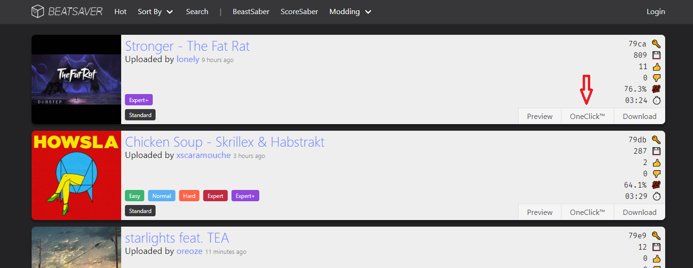

# Description

This is a quick and dirty proof of concept to take advantage of the OneClick button (see screenshot below) on https://beatsaver.com without the need of installing any mods / mod assistant. If there is any interest shown by the community, I will improve this. In its current state, it answers my personal needs.

# Installation

Since there is currently no published build:

1. Download .NET Core SDK
1. Clone this repo somewhere
1. Run `dotnet run` in the root folder of this repository

# Known issues

1. Does not work if you do not have the game installed on C and on the default steam library path
1. Moving the location of the project will break it - you will have to re-do the installation process

# Button example

